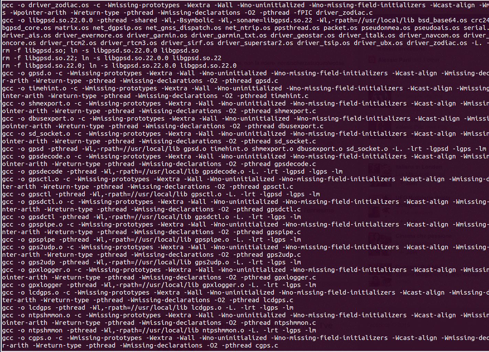
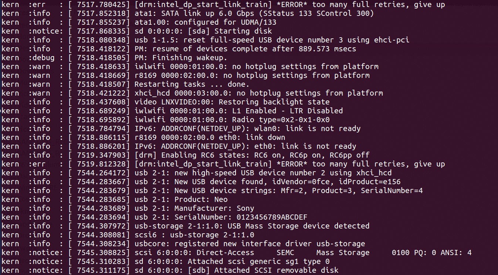
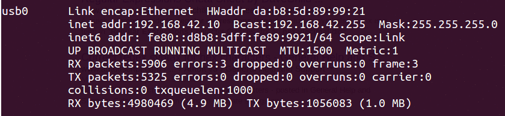

Raffaello
=========

What is it?
-----------

Raffaello is a powerful yet simple to use command line (CLI) output colorizer. What does that mean?
Let say you have a CLI tool that prints out lot of information (e.g. gcc(1)/g++, dmsg, etc.) you have to read carefully, more specifically when some error/warning messages occurs, how hard is that? How easier would it be if some keywords were highlighted with meaningful colors? Well, Raffaello just does that.

Here are some examples, since *a picture is worth a thousand words*, more pictures are even better:

### Make

### dmsg

### ifconfig

The following is an example of "conditional" hightlightning. I wanted to highlight the word "errors" only when actual errors have occurred. This is the pattern

    (errors):[1-9]=>red_bold

this way, strings like `*errors:0"` are not highlighted and I do not get false warnings.

## Installation

`Raffaello` is simple to install using `setuptools`. Just type the following command

    # python setup.py install

## Usage

`Raffaello` is simple to use. It just needs to know which **keywords** you want to colorize (you can even use [regular expressions](https://docs.python.org/2/library/re.html) using Python syntax) and with which **colors**.
The basic syntax is the following.

    raffaello <arguments> --- command-line-tool [command-line-tool-arguments]

Color **configuration** can be provided **direclty through command line** with arguments:

    .$ /raffaello "pattern1=>colorA" "pattern2=>colorB" "pattern3=>colorA" ... --- command [arguments]

    e.g.

        $ ./raffaello "\d+\.\d+=>blue" --- dmesg        # this will make dmesg numbers blue
        $ ./raffaello '.*[Ee]rror.*=>red' --- dmesg     # this will highlight lines with error messages (if any) in red

**Configuration** can also be provided **through a config file** like the following

    $ ./raffaello --file=dmesg.cfg --- dmesg

where configuration file is

    $ cat dmesg.cfg

    # Dmesg config file example. Comment lines will be ignored
    .*[Ee]rror.*=>red_bold
    .*ERROR.*=>red_bold
    timed\sout=>red
    .*[Ww]arning.*=>yellow

    1. no spaces are allowed at both sides of `=>` sign
        error => red            WRONG
        error=> red             WRONG
        error =>red             WRONG
        error=>red              OK
    2. if a pattern contains spaces, they must be defined using "\s" symbol, for example:
        could not=>red_bold     WRONG
        could\snot=>red_bold    OK

To **avoid long file paths** it is possible to put your config files under `<your-home>/.raffaello` directory. Raffaello will look there to find some config files

#### Notes

1. Well, `gcc` has also a --color option at least
