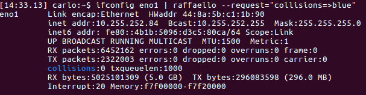
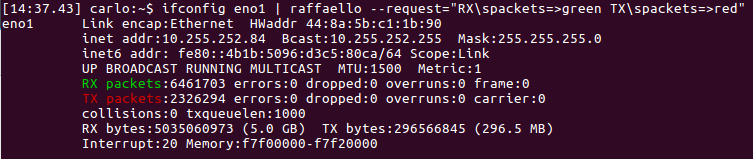
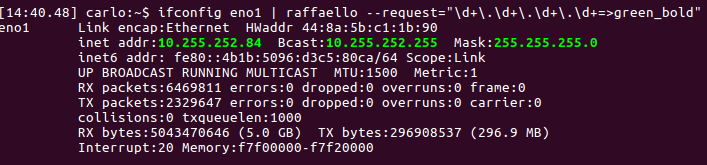
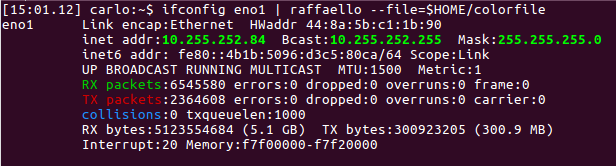

[](https://badge.fury.io/py/raffaello)
[](https://travis-ci.org/clobrano/raffaello)
[](https://www.paypal.me/clobrano/5)

Raffaello - output colorizer
============================

Raffaello colorizes the output stream of any command-line tool (e.g. gcc/g++, cmake, dmesg, syslog and custom), making it easier to read.

## Usage

The raffaello's command line interface let you use two call modes: **pipes** and **command**.

In pipe mode you call raffaello like:

    <output stream source> | raffaello [options]

In command mode raffaello will call your stream source in your behalf

    raffaello [options] -c <output stream source>


To highlight the output stream, Raffaello has **2 color modes** and **2 styles modes**:

Color modes:

- **8 colors** mode let you use the following names: *black, red, green, yellow, blue, magenta, cyan, light_gray*. **NEW** Starting from version 3.0.3 Raffaello introduces a *blind* color: *lines matching the pattern with color "blind" will be REMOVED from the stream*. This will improve readability of dense stream output.

- **256 colors** mode let you use other 248 colors and choose between foreground or background colors (you can mix 8 colors mode names with 256 color mode names):

Color styles:

- Foreground color names are in the form `colorNUM`. E.g. foreground red is *color001*
- Background color names are in the form `bgcolorNUM`. E.g. background red is *bgcolor001*

With the styles you can blend colors in **bold** and **underlined**

- foreground red bold is *color001_bold*
- foreground red underlined is *color001_underlined*

Call `raffaello -l` to see the complete list of available colors.


### Full interface description

```
Usage: raffaello (-p PRESET | -r REQUEST | -f FILE | -l) [options]

    -p PRESET, --preset=PRESET              Prebuilt config files for coloring known output streams (gcc/g++, cmake, dmesg, gcc/g++, ModemManager, logcat...)
    -r REQUEST --request=REQUEST            The requested text/color mapping string. Multipe requests are separated by a space. Regular expression are supported. E.g. "error=>red [Ww]arning=>yellow_bold".
    -f FILE --file=FILE                     Path to the custom text=>color configuration file.
    -c COMMAND --command=COMMAND            Instead of using raffaello with pipes, set the command-line tool to be executed by raffaello directly. E.g. -c "dmesg -w".
    -m, --match-only                        Print only the lines that match against some defined pattern.
    -d DELIMITER --delimiter=DELIMITER      If you don't like "=>" as delimiter between text and color, use this flag to change it. E.g. -d & [default: =>]
    -l, --list                              List all the available colors and presets
    -v --verbose                            Enable debug logging
```

**NEWS**
- version 3.0.3 --match-only flag Print only the lines that match against any defined pattern.

## Examples

The simpler usage is using the `request` flag. The `request` flag requires a string in the form "text=>color anothertext=>anothercolor", where text can be a constant string or a [Regular expression](https://docs.python.org/2/library/re.html), while color is the name of the color to use (see [Usage](#Usage) section)

* Simple constant text highlight

        $ ifconfig eno1 | raffaello --request="collisions=>blue"



* Highlight of multiple texts. Here you can see that spaces in the "text part" are not allowed. Use \s instead.

        $ ifconfig eno1 | raffaello --request="RX\spackets=>green TX\spackets=>red"



* Highlight with regular expressions

        $ ifconfig eno1 | raffaello --request="\d+\.\d+\.\d+\.\d+=>green_bold"




For more complex color mapping you can write a file with a line for each *text=>color* entry, like the following

    collisions=>blue
    RX\spackets=>green
    TX\spackets=>red
    \d+\.\d+\.\d+\.\d+=>green_bold

save the file and provide it to raffaello using its fullpath

    $ ifconfig eno1 | raffaello --file=$HOME/colorfile



Color files can be reused in other color files using the `include` directive followed by the fullpath to the file.

Using fullpath is annoying, tough, so Raffaello has a special path under $HOME/.raffaello. All the colorfiles inside this folder can be passed using simply their filename, without the path.

    # include custom colorfile in $HOME/.raffaello
    include some_custom_colorfile
    
    # include custom color outside $HOME/.raffaello
    include $HOME/path/to/some_other_custom_color

    collisions=>blue
    RX\spackets=>green
    TX\spackets=>red
    \d+\.\d+\.\d+\.\d+=>green_bold


Raffaello provides some built-in colorfiles, called **presets**, for known tools like cmake, gcc/g++, dmesg, etc.
The presets can be used alone using `--preset` flag or even included in custom colorfile in order to extend their colormaps.

    # Include a preset colorfile
    include errors
    
    # include custom colorfile in $HOME/.raffaello
    include some_custom_colorfile
    
    # include custom color outside $HOME/.raffaello
    include $HOME/path/to/some_other_custom_color

    collisions=>blue
    RX\spackets=>green
    TX\spackets=>red
    \d+\.\d+\.\d+\.\d+=>green_bold

For a full list of presets, call `raffaello --list`.


## Raffaello is a python module

Raffaello can be used as a python module inside other source codes

```python
from raffaello import Raffaello, Commission

request = '''
error=>red
warning=>yellow_bold
bluish\stext=>color026
'''

c = Commission(request)
r = Raffaello(c.commission)

print(r.paint('Sample message with error, warning and a bluish text.'))
```

## Install

Install from source using setuptools. Just type the following command

    # python setup.py install

Install from [PyPI - the Python Package Index](https://pypi.python.org/pypi)

    # pip install raffaello


## Dependencies

* `docopt` language for description of command-line interfaces
